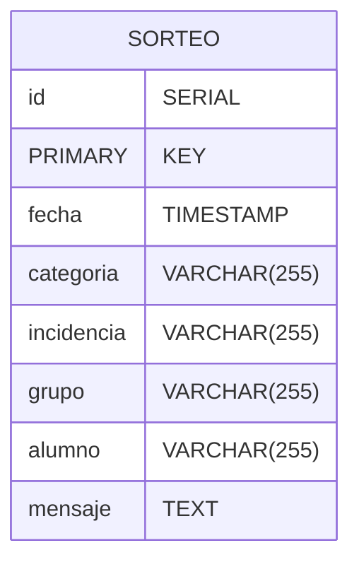
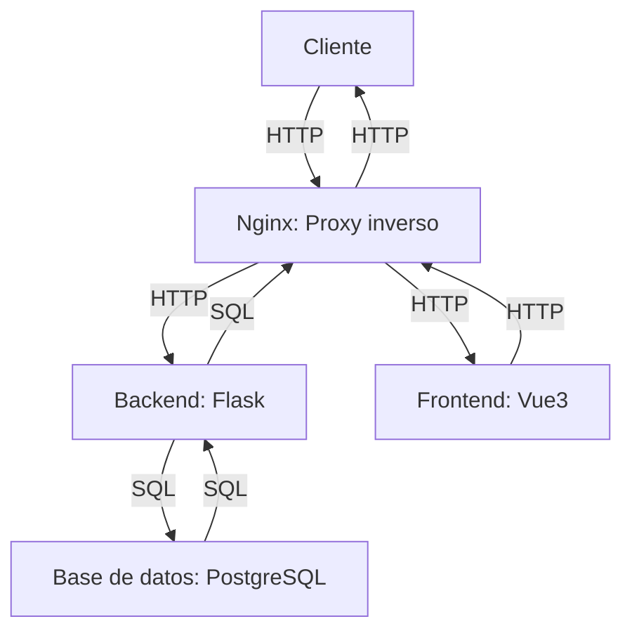

# ruleta 2.0
Ruleta 2.0 es un proyecto que consiste en una implementación web mejorada de las ruletas genéricas disponibles en internet. Este sistema tiene como objetivo principal automatizar y optimizar el proceso de asignación de incidencias categorizadas, proporcionando una solución eficiente y accesible para el ámbito académico, específicamente en el ramo de Gestión de Proyectos Tecnológicos de la Universidad de Talca.

## Características clave
- **Gestión de incidencias**: Organización de incidencias por categorías y registro de sorteos semanales.
- **Base de datos centralizada**: Almacenamiento de los resultados de los sorteos, incluyendo el mensaje asociado a cada asignación.
- **Interfaz web**: Visualización de los sorteos y sus resultados de los sorteos, incluyendo el mensaje asociado a cada asignación.
- **Flujo semanal automatizado**: Simplificación del proceso de asignación de indcidencias y penitencias, sin necesidad de gestionar grupos o usuarios complejos.

## Requisitos para correr
- Docker
- Docker Compose
- Python 3.8 o superior
- pip
- pipenv
- node
## Como correr el proyecto
Se asumira que se tiene acceso al repositorio y github cli para la ejecución
de este item.
1. Clonar el repositorio:
```bash
gh repo clone ktax06/ruleta
```
2. Entrar al directorio del proyecto:
```bash
cd ruleta
```
3. Correr
```bash
docker-compose up -d --build
```
4. para detener usar:
```bash
docker-compose down --remove-orphans
```
5. para recompilar la imagen (Linux):
```bash
docker-compose down --remove-orphans && docker-compose up -d --build
```

## Historias de usuario
| ID | Historia de usuario | Prioridad | Estado |
|----|---------------------|-----------|--------|
| HU01  | Como usuario, quiero cargar un archivo CSV con categorías, incidencias y su probabilidad de aparición para configurar la ruleta fácilmente. | Alta | Pendiente |
| HU02  | Como usuario, quiero visualizar una ruleta por categoría para seleccionar una categoría de forma aleatoria. | Alta | Pendiente |
| HU03  | Como usuario, quiero visualizar una segunda ruleta con las incidencias de la categoría seleccionada para sortear una incidencia específica. | Alta | Pendiente |
| HU04  | Como usuario, quiero que al sortear una incidencia se muestre un popup con la incidencia seleccionada, permitiendo ingresar información extra relevante. | Media | Pendiente |
| HU05  | Como usuario, quiero que el sistema permita realizar sorteos de forma continua sin necesidad de reiniciar el flujo. | Baja | Pendiente |
| HU06  | Como usuario, quiero poder realizar sorteos por eliminación de categorías o incidencias para evitar repeticiones en un mismo flujo. | Baja | Pendiente |
| HU07  | Como usuario, quiero poder consultar un historial de sorteos con detalles de las categorías, incidencias, grupos, alumnos y mensajes asociados. | Baja | Pendiente |
| HU08  | Como usuario, quiero editar manualmente las categorías, incidencias y su probabilidad de aparición para editar la configuración de la ruleta fácilmente. | Alta | Pendiente |
| HU09  | Como usuario, quiero filtrar el historial por fecha, categoría o grupo para encontrar información específica. | Media | Pendiente |
| HU10  | Como usuario, quiero ver estadísticas y gráficos que muestren de mejor manera el historial de sorteos de la ruleta. | Baja | Pendiente |
| HU11  | Como usuario, quiero integrar esta ruleta con otras similares en una misma aplicación web. | Media | Pendiente |
| HU12  | Como usuario, quiero personalizar aspectos estéticos de la ruleta como colores, aspecto, añadir imágenes, etc. | Baja | Pendiente |
| HU13  | Como usuario, quiero ingresar los alumnos que participaran de cada sorteo. | Baja | Pendiente |
| HU14  | Como usuario, quiero que el sistema me permita realizar un sorteo  para determinar que alumno es afectado en la incidencia. | Baja | Pendiente |

## Modelo de datos
El modelo de datos se basa en una base de datos relacional, utilizando PostgreSQL como sistema de gestión de bases de datos. A continuación se presenta el esquema de la base de datos, en este caso se utiliza una base de datos relacional con el objetivo de permitir la escalabilidad en el sistema, pero inicialmente nuestro modelo no es relacional:



## Arquitectura
La arquitectura del sistema se basa en una aplicación web de tipo cliente-servidor, donde el cliente accede a la aplicación mediante un navegador web haciendo uso de la nube, la apliación esá construida dentro de un docker compose que corre 4 servicios que comparten la misma red, estos son:
- **Backend**: Implementado en Python utilizando el framework Flask, encargado de gestionar la lógica de negocio y la comunicación con la base de datos.
- **Frontend**: Implementado en Vue3, encargado de gestionar la interfaz de usuario y la comunicación con el backend.
- **Base de datos**: Implementada en PostgreSQL, encargada de almacenar la información del sistema.
- **Nginx**: Servidor web encargado de gestionar las peticiones HTTP, operando como proxy inverso entre el cliente y el backend.




